# 자바 헷갈리는 개념 정리

<details>
<summary style="font-size:20px">추상 클래스</summary>
<div markdown="1">

#### 개요

* 상속까지는 언제 왜 어떻게 사용하는지 알음 -> 추상 클래스는 실제로 구현해본적이 없기에 왜 언제 어떻게 사용하는지 알아보기위함.

* 상속은 왜 사용할까?
  * 만들어져 있는 클래스를 재사용함(overriding)으로써 중복된 코드를 줄이고 간결해지며 공통적인 기능을 부모 클래스에 추가하면 자식 클래스에서 재사용이 가능함으로 확장성 또한 용이함 즉, 유지보수가 쉽고, 확장성이 용이하며 재사용이 가능하고 코드가 간결해짐.
* 상속은 언제 사용할까?
  * IS-A 관계
    * 상위 클레스에서 하위 클래스보다 일반적인 개념의 사용(ex Animal)
    * 하위 클래스에서 상위 클래스보다 구체적인 개념 사용(ex Dog bark, Eagle flying)
    * 높은 클래스간의 결합도 -> 복잡한 구조는 어울리지 않음.
  * HAS-A 관계
    * 클래스를 재활용하고 싶다해서 무조건 상속을 받지 않음.
    * (ex Student가 Subject를 포함)
    * 일반적인 구현 방법

#### 추상 클래스

* 상속받는 자식 클래스가 반드시 추상 메소드를 구현하도록 하기 위함.
  * 그래서 왜 추상 클래스를 사용할까? why?? 
  * 공통적인 부분은 만들어진 기능을 사용하고, 이를 받아 사용하는 쪽에서는 자신에게 필요한 부분만 재정의하여 사용함으로써 유지보수와 통일성을 유지하기위함.
  * **공통된 필드와 메서드를 통일할 목적**
  * ex) 10명의 개발자가 자동차를 상속받아 각자만의 실체클래스를 구현하는경우
  * 수만줄의 A자동차가 계약만료되고, B자동차를 새로 교체할 때 객체 인스턴스만 변경하면됨.

> 추상클래스 예시

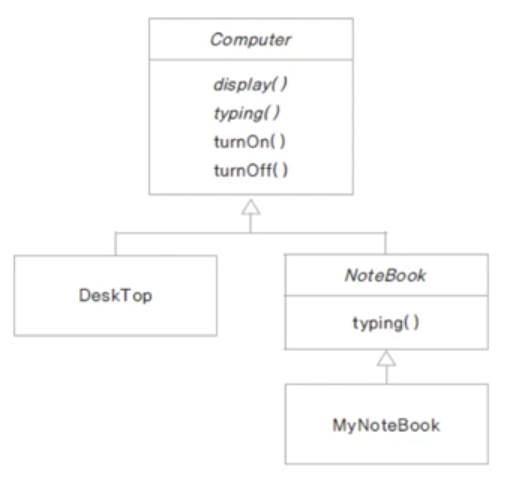

```java
package oop4;

public abstract class Computer {

	public abstract void display();
	public abstract void typing();
	
	public void turnOn() {
		System.out.println("전원을 켭니다.");
	}
	
	public void turnOff() {
		System.out.println("전원을 끕니다.");
	}
}
```

```java
package oop4;

public class Desktop extends Computer{

	@Override
	public void display() {
		System.out.println("PC 화면");
	}

	@Override
	public void typing() {
		System.out.println("PC 타이핑");
	}

	@Override
	public void turnOff() {
		System.out.println("PC 전원끄기");
	}
}

```

```java
package oop4;

public abstract class NoteBook extends Computer{

	@Override
	public void display() {
		System.out.println("노트북 화면");
	}
}
```

```java
package oop4;

public class MyNoteBook extends NoteBook{

	@Override
	public void typing() {
		System.out.println("MyNoteBook typing");
	}
}
```

```java
package oop4;

public class ComputerTest {

	public static void main(String[] args) {
		
		Computer computer = new Desktop(); 
		NoteBook book = new MyNoteBook();
		//Computer computer = new Computer(); 추상메서드이므로 new를 통한 객체 생성 불가.
		
		computer.display();
		book.display();
	}
}
```
* 추상클래스에서 상위클래스인 Computer class 생성.
* Desktop은 Computer를 상속받으며, display(), typing() 메소드를 오버라이딩 하고있으며 turnOff() 도 재정의해서 사용함.
* Notebook도 Computer를 상속받으며 추상클래스로서 Notebook 클래스를 생성함.
* MyNoteBook은 NoteBook을 상속받음.
* Main 메소드인 ComputerTest에서는 다형성을 사용하여 객체의 메소드 호출이 가능함.
* 단, 추상메소드는 new를 통한 객체 생성이 불가함.
  
</div>
</details>

<details>
<summary style="font-size:20px">인터페이스</summary>
<div markdown="1">

#### 개요

* 추상 클래스는 부모인 최상단 클래스에서 공통적인 기능을 구현함으로써 자식 클래스에서 오버라이딩하여 확장성 및 유지보수에 용이하도록 도와줌.
* 인터페이스는?? 다중 상속 기능 제공과 추상 클래스와 비슷한 역할을 한다는 것으로 알고있음.
* 추상클래스와 어떤 다른 점이 있고 어떤 상황에 쓰이는가?
  
#### 인터페이스

* 추상 클래스는 IS-A, 인터페이스는 HAS-A.
* 추상 클래스는 한 개의 클래스만 상속이 가능하고 자식 클래스에서 선택적으로 오버라이딩하여 사용할 수 있도록 하기위함.
* 인터페이스는 다중 상속이 가능하고 공통으로 필요한 기능들도 모든 클래스에서 오버라이딩하여 재정의 해야함.


> 인터페이스와 추상 클래스 예시

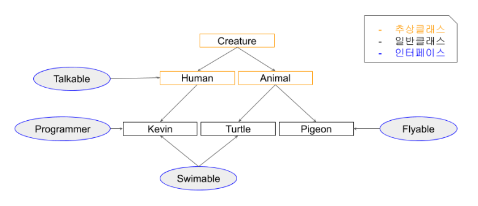

```java
public abstract class Creature {
    private int x;
    private int y;
    private int age;
    
    public Creature(int x, int y, int age) {
        this.age = age;
        this.x = x;
        this.y = y;
    }
    
    public void age() {
        age++;
    }
    
    public void move(int xDistance) {
        x += xDistance;
    }
    
    public int getX() {
        return x;
    }
    public void setX(int x) {
        this.x = x;
    }
    public int getY() {
        return y;
    }
    public void setY(int y) {
        this.y = y;
    }
    
    public abstract void attack();
    public abstract void printInfo();
    
    @Override
    public String toString() {
        return "x : " + x + ", y : " + y + ", age : " + age;
    }
}
```
* 인간과 동물은 생명체를 상속.
* 각 생명체들은 구분에 따라서 인간과 동물을 상속, 할 수 있는 기능들을 인터페이스로 구현.
* 공통적으로 이동할 수 있는 기능인 move를 하위클래스에서 상속할 수 있도록 일반 메소드로 구현.
* attack, printInfo 는 각각 생명체에 따라 다른 기능으로 구현하기 때문에 추상메소드로 구현.

```java
public abstract class Animal extends Creature{
    
    public Animal(int x, int y, int age) {
        super(x, y, age);
    }
    
    @Override
    public void attack() {
        System.out.println("몸을 사용하여 공격!!");
    }
}
```

* 동물 클래스는 생명체이므로 Creature 추상클래스를 상속받음.
* 몸을 사용하여 공격하는 attack 메소드를 오버라이딩.
* **Q.조상클래스인 Creature 에서 지정한 printInfo 메소드는 왜 사용하지 않았을까?**
  * 동물클래스도 abstract 추상 클래스를 사용함으로써 앞으로의 생길 자식클래스에게 위임해서 사용하기 위함.

```java
public abstract class Human extends Creature implements Talkable{
    public Human(int x, int y, int age) {
        super(x, y, age);
    }
    
    @Override
    public void attack() {
        System.out.println("도구를 사용!!");
    }
    
    @Override
    public void talk() {
        System.out.println("사람은 말을 할 수 있다.");
    }
}
```

* Human 클래스도 Animal 클래스와 마찬가지로 추상 클래스로 구함.
* 하지만 여기서 Animal 클래스와 다르게 Talkable 인터페이스를 구현한 차이점이 있음.

```java
public interface Talkable {
    abstract void talk();
}
```

* 인터페이스는 이정표와 같은 것으로 정리해두자.
* Talable를 인터페이스를 구현할 경우 talk() 메소드를 오버라이딩하여 사용할 수 있음.

```java
public interface Flyable {
    void fly(int yDistance);
    void flyMove(int xDistance, int yDistance);
}
```

* 새 종류가 구현할 인터페이스 구현. 다른 동물들과는 다르게 y행으로 이동할 수 있는 메소드 선언함.

```java
public class Pigeon extends Animal implements Flyable{
    public Pigeon(int x, int y, int age) {
        super(x, y, age);
    }
    
    @Override
    public void fly(int yDistance) {
        setY(getY() + yDistance);
    }
    
    @Override
    public void flyMove(int xDistance, int yDistance) {
        setY(getY() + yDistance);
        setX(getX() + xDistance);
    }
    
    @Override
    public void printInfo() {
        System.out.println("Pigeon -> " + toString());
    }
}
```

* 비둘기는 동물 클래스를 상속받고 날 수 있는 동물이므로 Flyable 인터페이스를 구현함.
* 여기서 printInfo 는 조상 클래스인 Creature 클래스에서의 추상메소드를 오버라이딩하였음.

```java
public interface Swimable {
    void swimDown(int yDistance);
}
```

* **중요한 공통된 기능을 사용하는 인터페이스**
  * 거북이와, 케빈이라는 클래스를 작성할 때 두 생명체는 모두 수영을 할 수 있다고 정의함.
  * 하지만 동물이나 사람중에서도 수영을 못하는 경우도 있기에 swimDown 추성메소드가 아닌 Siwmable 인터페이스를 구현.
  * 각각 따로 정의하여 구현시킴으로써 가독성도 좋고 유지보수측면에서 좋음.

```java
public class Turtle extends Animal implements Swimable{
    public Turtle(int x, int y, int age) {
        super(x, y, age);
    }
    
    @Override
    public void swimDown(int yDistance) {
        setY(getY() - yDistance);
    }
    
    @Override
    public void printInfo() {
        System.out.println("Turtle -> " + toString());
    }
}

```

* 거북이 클래스에서는 Swimable 을 구현하고 swimDown 재정의하여 사용.

```java
public class Kevin extends Human implements Programmer, Swimable{
    public Kevin(int x, int y, int age) {
        super(x, y, age);
    }
    
    @Override
    public void coding() {
        System.out.println("Hello World!");
    }
    
    @Override
    public void swimDown(int yDistance) {
        setY(getY() - yDistance);
        if(getY() < -10) {
            System.out.println("너무 깊이 들어가면 죽을수도 있어!!");
        }
    }
    
    @Override
    public void printInfo() {
        System.out.println("Kevin -> " + toString());
    }
}

```

* Kevin은 다중구현을 통해서 수영도 할 수 있고, 코딩도 할 수 있는 사람

```java
public interface Programmer {
    void coding();
}
```

```java
public class Main {
    public static void main(String[] args) {
        Pigeon p = new Pigeon(5,10,14);
        p.printInfo();
        p.age();
        p.move(100);
        p.printInfo();
        p.fly(5);
        p.printInfo();
        p.flyMove(10, 20);
        p.printInfo();
        p.attack();
        System.out.println();
        
        Kevin kev = new Kevin(0, 0, 35);
        kev.printInfo();
        kev.age();
        kev.move(10);
        kev.printInfo();
        kev.attack();
        kev.coding();
        kev.swimDown(20);
        kev.printInfo();
        kev.talk();
        System.out.println();
        
        Turtle tur = new Turtle(100, -10, 95);
        tur.printInfo();
        tur.age();
        tur.move(-100);
        tur.printInfo();
        tur.attack();
        tur.swimDown(1000);
        tur.printInfo();
    }
}
```

* 메인메소드 구현.
 
#### 요약
> **추상 클래스 : 상속 관계를 타고 올라갔을 때 같은 조상클래스를 상속하는 똑같은 기능이 필요할 때!**
		
> **인터페이스: 상속 관계를 타고 올라갔을 때 다른 조상클래스를 상속하는 기능이 필요할 때!**

</div>
</details>

<details>
<summary style="font-size:20px">Object 클래스</summary>
<div markdown="1">

#### 개요

* import 하지 않아도 자동으로 import되는 Object 클래스란 무엇인가 알아보기위함

#### Object 클래스

* Object 클래스는 모든 클래스의 최상위 조상 클래스
* Object 메소드는 밑에 링크 참고 참고.
  * http://www.tcpschool.com/java/java_api_object
  * https://docs.oracle.com/javase/8/docs/api/java/lang/Object.html

```java
public class Student{

	private int studentNum;
	private String studentName;
	
	public Student(int studentNum, String studentName) {
		this.studentNum = studentNum;
		this.studentName = studentName;
	}

    @Override
	public boolean equals(Object obj) {

		if(obj instanceof Student) {
			Student std = (Student)obj;
			if(this.studentNum == std.studentNum) {
				return true;
			}else {
				return false;
			}
		}
		return false;
	}

    @Override
	public int hashCode() {
		return studentNum;
	}
}
```

* studentNum 같은 상황일 경우의 로직을 추가할 때 Student가 obj의 instancof에 해당할 경우
* Student 의 힙메모리에 담긴 객체 std = (다운캐스팅 Student) obj 는 같음.
* 만약 현재 Student의 studentNum 와 힙메모리에 담긴 객체 std studentNum이 같으면 true를 반환
  
```java
public class EqualsTest {
    public static void main(String[] args){
		Student st1 = new Student(100, "Lee");		
		Student st2 = new Student(100, "Son");

		System.out.println(st1.equals(st2));    // true
		System.out.println(st1 == st2);         // false

		System.out.println(st1.hashCode());     // 100
		System.out.println(st2.hashCode());     // 100
		
		System.out.println(System.identityHashCode(st1));   // ~~~
		System.out.println(System.identityHashCode(st2));   // ~~~
    }
}
```

* equals는 Object 에서 재정의하여 사용한 로직을 반영하여 주소값을 비교했을 때 true 가 나옴.
* hashCode 같은 경우도 studentNum 을 return 받았기 때문에 100 이라는 값이 나옴.
* System 에서 static 메소드로 정의해놓은 identityHashCode 메소드는 실제 HashCode의 주소값을 알려주므로 다른 값이 나옴.

### equals()

**동일성과 동등성**

* 동일성은 같은 메모리에 있는 참조값이 동일한지 확인하는 것.
* 동등성은 논리적으로 같은지 확인하는 것.

```java
User a = new User("TMKR");	// 참조 x001
User b = new User("TMKR");	// 참조 x002
```

* 회원 번호는 동일하지만 물리적으로 다른 메모리에 존제히는 객체이므로 동일성은 다르지만 동등성은 같다.


</div>
</details>

<details>
<summary style="font-size:20px">StringBuilder, StringBuffer</summary>
<div markdown="1">

#### 개요

* StringBuilder, StringBuffer 가 언제 어떻게 쓰이는지 알아보기위함.
* textblock은 java13부터 지원.

```java
public class StringTest {

	public static void main(String[] args) {
		String java = new String("java");
		String android = new String("android");
		
		System.out.println(System.identityHashCode(java));  //2104457164


		java = java.concat(android);
		
		System.out.println(System.identityHashCode(java));  //1521118594
	}
	
}
```

* 위의 코드에서 java를 새로 정의해서 사용하면 메모리가 새로 생성돼어 비효율적임.
* 그래서 이 때 StringBuilder, StringBuffer 를 사용함.

#### StringBuilder, StringBuffer

* 문자열을 여러번 연결하거나 변경할 때 사용하면 유용하게 쓰임.
* 새로운 인스턴스를 생성하지 않고 내부적으로 가변적인 char[] 멤버 변수를 가지며 변경함.
* 단일 쓰레드에서는 StringBuilder 을 권장, StringBuffer는 멀티 쓰레드 프로그래밍에서 동기화를 보장함.

```java
public class StringBuilderTest {

	public static void main(String[] args) {
		String java = new String("java");
		String android = new String("android");

		StringBuilder builder = new StringBuilder(java);
		System.out.println(System.identityHashCode(builder));   //2104457164
		builder.append(android);
		
		System.out.println(System.identityHashCode(builder));   //2104457164
	}
}
```

* 계속적으로 가변하기때문에 같은 메모리값을 가지고 있음.
* 단일 쓰레드 환경에서는 StringBuilder을 사용, 멀티 쓰레드 환경에서 동기화를 하는 경우 StringBuffer를 사용하자.

</div>
</details>

<details>
<summary style="font-size:20px">Class 클래스</summary>
<div markdown="1">

#### 개요 

* Class 클래스는 무엇이고 어디에 쓰이는지 알아보기위함.

#### Class 클래스

* 동적 로딩이 가능함.
  * 컴파일 시 데이터 타입이 bing 되지않고 실행중에 데이터 타입을 binding함.
  * 런타임시에 원하는 클래스를 로딩하여 binding 할 수 있다는 장점이 있음.
  * 컴파일 시에 타입이 정해지지 않으므로 동적 로싱시 오류가 발생하면 프로그램 장애 발생 가능성이 있음.

```java
public class StringTest {
	
	public static void main(String[] args) throws ClassNotFoundException {
		
		Class c = Class.forName("java.lang.String");
		System.out.println(c);
		
		Constructor[] cons = c.getConstructors();
		for(Constructor co : cons) {
			System.out.println(co);
		}
		
		Method[] me =  c.getMethods();
		for(Method method : me) {
			System.out.println(method);
		}
	}
}
```

* Class객체 생성 후 Class.forName 을 통해 java.lang.String에 관한 class들을 불러올 수 있음.
* 마찬가지로 Class 클래스에 담긴 생성자 getConstructors, 메소드 getMethods 를 통해 불러올 수 있음. (실제로는 잘 안쓰임,, 알아만두자)

* Class 관련 문서는 아래 참고.
* https://docs.oracle.com/javase/8/docs/api/java/lang/Class.html
</div> 
</details>

<details>
<summary style="font-size:20px">Stack</summary>
<div markdown="1">

#### 스택

* Stack 은 Last In First Out LIFO(후입선출) 구조.
* 맨 마지막 위치(top) 에서만 자료를 추가, 삭제 꺼내올 수 있음 (중간의 자료를 꺼낼 수 없음)
* ex) 가장 최근의 자료를 찾아올 때, 게임에서 히스토리를 유지하고 이를 무를 때 사용, 택배상자가 쌓여있는 모양 

#### 구현방법

* 크게 배열을 이용하는방법과 리스트를 이용하는방법 두 가지로 나뉨.

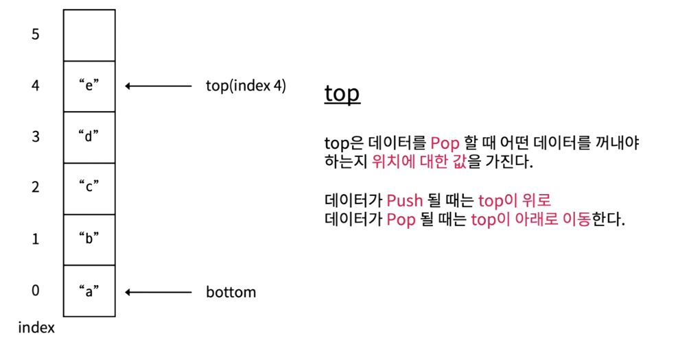

* top 변수는 배열의 가장 마지막으로 저장된 요소의 index를 저장함.
* 처음에 아무값도 저장하지 않는 상태이면 -1을 저장.
* push 하면 top 은 index에서 + 1 저장
* pop 하면 top은 index - 1 저장

```java
package ch05;

public class ArrayStack {

	int size;
	int top = -1;
	Object[] Arr;
	
	public ArrayStack(int size) {
		this.size = size;
		Arr = new Object[size];
	}
	
	public boolean isEmpty() {
		return top == -1;
	}
	
	public boolean isFull() {
		return this.size == this.top + 1;
	}
	
	public void push(int data) {
		
		if(isFull()) {
			throw new ArrayIndexOutOfBoundsException();
		}
		
		this.Arr[++top] = data;
	}
	
	public Object pop() {
		
		if(isEmpty()) {
			throw new ArrayIndexOutOfBoundsException();
		}
		
		Object poppedData = Arr[top];
		Arr[top--] = null;
		
		return poppedData;
	}
	
	public Object peek() {
		if(isEmpty()) {
			return null;
		}else {
			return this.Arr[top];
		}
	}
	
}
```

* push
  * 배열의 요소가 가득찼는지 판별해주는 ifFull()
  * Arr배열의 탑이 1씩 증가하는 값은 data에 담음.
* pop
  * 배열의 요소가 비었는지 판별해주는 isEmpty()
  * top index에 위치하는 Arr배열값 return
  * 탑이 1씩 감소함.


```java
package ch05;

public class Main {

	public static void main(String[] args) {
        System.out.println("배열로 구현한 stack");
        ArrayStack arrayStack = new ArrayStack(1000);
        System.out.println("1,2,3,4,5 순으로 push()");
        arrayStack.push(1);
        arrayStack.push(2);
        arrayStack.push(3);
        arrayStack.push(4);
        arrayStack.push(5);

        System.out.print("stack 가장 위에 있는 데이터: ");
        System.out.println(arrayStack.peek());

        int arrayindex = arrayStack.top;
        for (int i = 0; i <= arrayindex; i++) {
            System.out.print("pop된 데이터: ");
            System.out.println(arrayStack.pop());
        }
	}
}
```

#### 결과

```
배열로 구현한 stack
1,2,3,4,5 순으로 push()
stack 가장 위에 있는 데이터: 5
pop된 데이터: 5
pop된 데이터: 4
pop된 데이터: 3
pop된 데이터: 2
pop된 데이터: 1
```

</div>
</details>

<details>
<summary style="font-size:20px">Queue</summary>
<div markdown="1">

#### Queue

* 맨 앞에서 자료를 꺼내거나 삭제하고, 맨 뒤에서 자료를 추가함.
* First In First Out (선입선출) 구조
* ex) 줄서기, 운영체제의 프로세스 관리 등에서 사용.

```java
package ch05;

public class StackQueue {
    int length;
    int front = 0;
    int rear = 0;
    Object[] queue;

    public StackQueue(int length) {
        this.length = length;
        this.queue = new Object[length];
    }

    public boolean isFull(){
        return front == rear && queue[front] != null;
    }

    public boolean isEmpty(){
        return front == rear && queue[front] == null;
    }

    public void enqueue(Object data){
        if(isFull()) {
            System.out.println("큐에 더 이상 데이터를 저장할 공간이 없습니다.");
            return;
        }
        queue[rear++] = data;
        rear = rear % queue.length;
    }

    public Object dequeue(){
        if(isEmpty()){
            System.out.println("큐가 비어있습니다");
            throw new ArrayIndexOutOfBoundsException();
        }
        Object dequeuedData = queue[front];
        queue[front++] = null;
        front = front % queue.length;

        return dequeuedData;
    }

    public Object peek(){
        return queue[front];
    }
}
```

* euqueue 함수 호출 시 꽉 찼는지 확인(isFull)
  * rear 가 가르키는 index로 접근 후, main에서 호출하는 data를 받아 데이터에 삽임함.
  * rear값은 1씩 증가하며, rear값이 배열의 크기를 넘지 못하도록 나머지 연산 진행.

* dequeue 함수 호출 시 큐가 비어있는지 확인(isEmpty)
  * front가 가리키는 index로 접근하여 데이터를 임시저장.
  * 다시 해당 index로 접근하여 null을 삽입 후 front 1씩 증가
  * front값이 배열의 크기를 넘지 못하도록 나머지 연산 진행.

```java
package ch05;

public class QueueMain {
	public static void main(String[] args) {
        System.out.println("------Stack으로 구현한 Queue------");
        StackQueue stackQueue = new StackQueue(100);
        int numberOfData = 5;

        for (int i = 0; i < numberOfData; i++) {
            stackQueue.enqueue(i);
            System.out.printf("%d를 Queue에 enqueue\n", i);
        }

        System.out.println("peek연산 결과: " + stackQueue.peek());

        for (int i = 0; i < numberOfData; i++) {
            System.out.print(stackQueue.dequeue() + " ");
        }
	}
}
```
#### 결과

```
------Stack으로 구현한 Queue------
0를 Queue에 enqueue
1를 Queue에 enqueue
2를 Queue에 enqueue
3를 Queue에 enqueue
4를 Queue에 enqueue
peek연산 결과: 0
0 1 2 3 4 
```
</div>
</details>

<details>
<summary style="font-size:20px">Generic</summary>
<div markdown="1">

#### 개요

* 변수 사용시 자료형을 지정하는데 사용할 때 쓰이는게 제네릭으로 알고있음.
* ex) ArrayList<Integer> arraylist = new ArrayList<Integer>(); 이런식으로 타입 지정해서 사용하곤 했음.
* Generic에 대해서 자세히 알아보기 위함.

#### Generic

* 클래스 내부에서 사용할 데이터 타입을 외부에서 지정하는 기법임.
* 변수를 선언할 때 변수의 타입을 지정해주듯이 객체에 타입을 지정해주는 것.
* 컴파일 타임에 타입 검사를 통한 예외 방지
  * ex) Object를 객체로 만들었을 때 다운캐스팅의 오류를 실행할 문제점.
* 불필요한 캐스팅을 없애 성능 향상
  * ex) 미리 타입을 지정하고 제한해놓음으로써 형 변환의 번거로움을 줄여 가독성 및 오버헤드 문제점을 막아줌.

#### Generic 사용방법

* 자료형 매개변수 T(type parameter) : 클래스를 사용하는 시점에 자료형을 지정. static 변수는 사용할 수 없음.

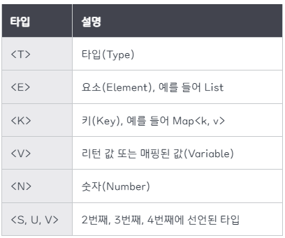

#### 자료형 매개변수를 이용한 컴파일 타임시 타입 검사를 통한 예외 방지

```java
class Apple {}
class Banana {}

class FruitBox {
    // 모든 클래스 타입을 받기 위해 최고 조상인 Object 타입으로 설정
    private Object[] fruit;

    public FruitBox(Object[] fruit) {
        this.fruit = fruit;
    }

    public Object getFruit(int index) {
        return fruit[index];
    }
}
```
```java
public static void main(String[] args) {
    Apple[] arr = {
            new Apple(),
            new Apple()
    };
    FruitBox box = new FruitBox(arr);

    Apple apple = (Apple) box.getFruit(0);
    Banana banana = (Banana) box.getFruit(1);
}
```

* 실행시 ClassCastException 런타임 에러 발생. 이와 같은 경우에는 빨간줄로 에러를 알려주지 않음 ! !
* 이유는 Apple 객체 타입을 FruitBox에 넣었는데 Banana를 형변환해서 가져오려고 했기 때문에 발생한 에러.
* 앞에 형변환을 (Object)로 다운캐스팅해도되지만 이 떄 제네릭을 사용하면 실수를 미연에 방지할 수 있음.
* 밑에 코드와 같이 자료형 매개변수를 지정하여 제내릭을 사용하자.

```java
class FruitBox<T> {
    private T[] fruit;

    public FruitBox(T[] fruit) {
        this.fruit = fruit;
    }

    public T getFruit(int index) {
        return fruit[index];
    }
}
```

* 이 처럼 타입 파라미터로 매개변수를 지정해줌으로써 잘못된 타입이 사용될 수 있는 문제를 제거함.

#### 불필요한 캐스팅을 없앰으로써 성능 향상

```java
Apple[] arr = { new Apple(), new Apple(), new Apple() };
FruitBox box = new FruitBox(arr);

// 가져온 타입이 Object 타입이기 때문에 일일히 다운캐스팅을 해야함 - 쓸데없는 성능 낭비
Apple apple1 = (Apple) box.getFruit(0);
Apple apple2 = (Apple) box.getFruit(1);
Apple apple3 = (Apple) box.getFruit(2);
```

* Apple 배열을 FruitBox의 Object 배열 객체에 넣고, 가져올 때는 다운캐스팅을 통해 가져와야했음.

```java
FruitBox<Apple> box = new FruitBox<>(arr);

Apple apple = box.getFruit(0);
Apple apple = box.getFruit(1);
Apple apple = box.getFruit(2);
```

* 미리 형변환을 지정해놓음으로써 형변환의 번거로움을 제거함과 동시에 타입 검사에 들어가는 메모리를 줄일 수 있음.

#### 잘 정리되어있는 링크 참고.
* https://inpa.tistory.com/entry/JAVA-%E2%98%95-%EC%A0%9C%EB%84%A4%EB%A6%ADGenerics-%EA%B0%9C%EB%85%90-%EB%AC%B8%EB%B2%95-%EC%A0%95%EB%B3%B5%ED%95%98%EA%B8%B0
</div>
</details>

<details>
<summary style="font-size:20px">HashMap</summary>
<div markdown="1">

#### HashMap

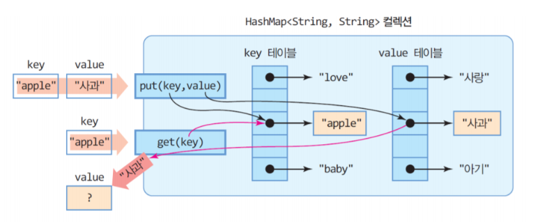

* HashMap 은 Map을 구현하여 Map과 유사한 특징을 가지고 있음.
* Map과 HashMap은 Key와 Value 두 쌍으로 데이터를 보관하는 자료구조
* HashMap은 key와 value를 하나의 쌍(entry) 로 저장하는 구조이며, 해싱을 사용하기 때문에 좋은 성능을 가짐.

```java
import java.util.HashMap;
import java.util.Iterator;
import java.util.Map;
import java.util.Map.Entry;

public class TestCode {
	public static void main(String[] args) {
		HashMap<String, Integer> hashMap = new HashMap<String, Integer>();
		
		hashMap.put("A", 101);
		hashMap.put("B", 102);
		hashMap.put("C", 103);
		
		System.out.println(hashMap);	//{A=101, B=102, C=103}
		
		System.out.println(hashMap.get("A"));	// 101
		
		System.out.println("---- entrySet() 사용");
		for(Entry<String, Integer> entry : hashMap.entrySet()) {
			System.out.println("Key : " + entry.getKey() + " value : " + entry.getValue());
		}
		System.out.println("---- keySet() 사용");
		for(String i : hashMap.keySet()) {
			System.out.println("key : " + i + " value : " + hashMap.get(i));
		}
		/*
		 * key와 value 둘 다 필요할경우 entrySet을 사용하고 key값만 필요할 경우 keySet을 활용
		 * keySet도 hashMap.get() 메소드를 통해 가져올 수 있으며 주로 사용하지만
		 * key값을 이용해서 value를 찾는 과정에서 시간이 소요되므로 성능상 entrySet()이 유리함.
		 */
		System.out.println("---- Iterator entrySet() 사용");
		Iterator<Entry<String, Integer>> entries = hashMap.entrySet().iterator();
		while(entries.hasNext()) {
			Map.Entry<String, Integer> entry = entries.next();
			System.out.println("Key : " + entry.getKey() + " value : " + entry.getValue());
		}
		System.out.println("---- Iterator keySet() 사용");
		Iterator<String> keys = hashMap.keySet().iterator();
		while(keys.hasNext()) {
			String key = keys.next();
			System.out.println("Key : " + key + " value : " + hashMap.get(key));
		}
	}
}
```

```
{A=101, B=102, C=103}
101
---- entrySet() 사용
Key : A value : 101
Key : B value : 102
Key : C value : 103
---- keySet() 사용
key : A value : 101
key : B value : 102
key : C value : 103
---- Iterator entrySet() 사용
Key : A value : 101
Key : B value : 102
Key : C value : 103
---- Iterator keySet() 사용
Key : A value : 101
Key : B value : 102
Key : C value : 103

```
</div>
</details>

<details>
<summary style="font-size:20px">내부 클래스</summary>
<div markdown="1">

#### 내부 클래스

* 하나의 클래스 내부에 선언된 또 다른 클래스.
* 오로지 클래스 메소드내에서 선언되어 사용된다면 클래스 내부에 넣어줌으로써 캡슐화를 적용할 수 있는 장점.
* instance class, static class, local class, anonymous class 4가지가 있음.
  
```java
package ch01;

class OutClass{
	
	private int num = 10;
	private static int sNum = 20;
	private InClass inClass;
	
	public OutClass(){
		inClass = new InClass();
	}
	
	
	private class InClass{
		
		int iNum = 100;
		
		//static int sInNum = 500;	// OutClass가 먼저 선언되어야하므로 오류
		
		void inTest() {
			
			System.out.println("OutClass num = " + num + "(외부 클래스 인스턴스 변수");
			System.out.println("OutClass sNum = " + sNum + "(외부 클래스 스태틱 변수");
			System.out.println("InClass inNum = " + iNum + "(내부 클래스 인스턴스 변수");
		}
	}
	
	public void usingClass() {
		inClass.inTest();
	}
}
public class InnterTest {

	public static void main(String[] args) {
		
		OutClass outClass = new OutClass();
		outClass.usingClass();
	}

}
```

#### 결과
```
OutClass num = 10(외부 클래스 인스턴스 변수)
OutClass sNum = 20(외부 클래스 스태틱 변수)
InClass inNum = 100(내부 클래스 인스턴스 변수)
```

* OutClass 인스턴스 변수 num과, 스태틱 변수 sNum, InClass 객체 생성, OutClass 가 생성될 때 inClass 생성됨.
* OutClass 의 인스턴스 클래스인 InClass를 생성
* InClass 에서는 내부 인스턴스 변수 iNum 생성.
* InClass 에 선언한 inTest() 메소드를 호출하려면 OutClass 에서 선언한 usingClass() 를 이용하여 호출함.

```java
class InClass
```

```java
public class InnterTest {

	public static void main(String[] args) {
		OutClass.InClass inClass = outClass.new InClass();
		inClass.inTest();
	}

}
```

* OutClass에서 선언한 InClass 의 private을 지우고 class로만 선언할 경우
* 외부클래스.내부클래스 형식으로 내부클래스를 초기화하여 사용할 수도 있음.
* 하지만 내부 클래스는 다른 클래스에서 직접 사용하는 것보단 외부 클래스에서 사용하는 것이 일반적이고,
* 위와 같이 메인 코드와 같이 내부 클래스의 인스턴스를 다른 클래스에서 만드는 경우는 드뭄.

```java

// 정적 내부 클래스 생성
static class InStaticClass{
    
    int iNum = 100;
    static int sInNum = 200;
    
    void inTest() {
        
        //System.out.println("OutClass num = " + num + "(외부 클래스 인스턴스 변수)");
        /*
        * 외부 클래스와 상관없이 만들어질 수 있기 때문에 OutClass에 있는 인스턴스 변수는 사용 불가능함.
        */
        System.out.println("InClass iNum = " + iNum + "(내부 클래스 인스턴스 변수)");
        System.out.println("OutClass sNum = " + sNum + "(외부 클래스 스태틱 변수)");
        System.out.println("InClass sInNum = " + sInNum + "(내부 클래스 스태틱 변수)");
    }		

    static void sTest() {

        //System.out.println("InClass iNum = " + iNum + "(내부 클래스 인스턴스 변수)");
        /*
        * static class의 static 메소드는 클래스가 생성되지 않아도 사용할 수 있으므로 사용 불가능함.
        */
        System.out.println("OutClass sNum = " + sNum + "(외부 클래스 스태틱 변수)");
        System.out.println("InClass sInNum = " + sInNum + "(내부 클래스 스태틱 변수)");
    }
}
```    

* static 키워드가 붙은 static class InStaticClass 내부 클래스 생성.
* 외부 클래스에 있는 인스턴스 멤버에는 접근이 불가함(why? 외부 클래스가 생성이 안되었을 수 있으므로)
  
* static void sTest 내부 클래스에 static 메소드 sTest() 생성.
* 내부 클래스의 인스턴스 변수 사용 불가능. InStaticClass가 생성되지 않아도 사용할 수 있는 전제가 있으므로.
  
```java
public class InnterTest {

	public static void main(String[] args) {
		OutClass.InStaticClass sInClass = new OutClass.InStaticClass();
		sInClass.inTest();
		
		System.out.println();
		
		OutClass.InStaticClass.sTest();		// 클래스 생성과 무관하게 바로 호출이 가능함.
	}

}
```

#### 결과

```
InClass iNum = 100(내부 클래스 인스턴스 변수)
OutClass sNum = 20(외부 클래스 스태틱 변수)
InClass sInNum = 200(내부 클래스 스태틱 변수)

OutClass sNum = 20(외부 클래스 스태틱 변수)
InClass sInNum = 200(내부 클래스 스태틱 변수)

```

#### 요약

* 내부 InClass에 선언된 Static Class는 OutClass 클래스의 인스턴스 변수는 사용할 수 없음.
  * why? 
  * 외부 클래스가 생성과 무관하게 호출될 수 있으므로 오류가 발생함.
* 내부 InClass에 선언된 static void sTest() 메소드는 외부,내부의 스태틱 변수만 사용이 가능함.

</div>
</details>

<details>
<summary style="font-size:20px">익명 내부 클래스</summary>
<div markdown="1">

#### 지역 내부 클래스

* 지역 변수와 같이 메소드 내부에서 정의하여 사용하는 클래스
* 메소드 호출이 끝나면 사용된 지역변수의 유효성은 사라짐.

```java
class Outer2{
	
	int outNum = 100;
	static int sNum = 200;
	
	/*
	 * 쓰레드를 사용하는 방법은 두 가지가 있음.
	 * 1. 쓰레드 클래스에서 상속 받아서 사용
	 * Runnable 인터페이스를 implements 사용해서 사용. 
	 */
	Runnable getRunnable(int i) {
		
		int num = 10;	// 로컬 변수 num, i는 스택 메모리에 생성됨.
		
		class MyRunnable implements Runnable{

			int localNum = 1000;
			
			@Override
			public void run() {
				
				//i = 50;
				//num = 20;
				/*
                 * 지역 내부 클래스내에 메소드에서는 변수는 재선언하여 사용할 수 없음. 
				 * 메소드가 호출되는 시점이랑 클래스 생성주기가 다르기 때문임.
				 * 메소드는 호출되고 끝나면 스택메모리는 사라짐 (i, num)
				 * run 이라는 메소드는 또 호출될 수 있는 여지가 있음.
				 * 그 때 i와 num이 없을 수도 있기 때문에 stack에 잡히면 안됨.
				 * 위의 i와 num을 사용하려면 final 상수로 사용해야함.
				 * final로 선언하면 상수 메모리에 호스턴스 area에 잡힘.
				 * 값을 바꿀 수 없음.
				 */
				System.out.println("i = " + i);
				System.out.println("num = " + num);
				System.out.println("localNum = " + localNum);
				
				System.out.println("outNum = " + outNum + "(외부 클래스 인스턴스 변수)");
				System.out.println("Outer2.sNum = " + Outer2.sNum + "(외부 클래스 스태틱 변수)");
			}
		}
		return new MyRunnable();
	}
}
```

* 지역 내부 클래스 Runnable에서 선언한 run() 메소드내에서는 변수를 재선언하여 사용할 수 없음 why?
  * 메소드가 호출되는 시점이랑 클래스 생성주기가 다르기 때문.
  * 즉, 메소드가 호출되고 나면 스택메모리에 존재하는 i, num 은 사라짐.
  * 이 때 run이라는 메소드는 다시 호출되는 여지가 있으므로 i와 num이 존재하지 않을 수도 있음.
* 그러면 왜 위에서 i, num, localNum은 멤버변수로서 선언이 가능한가?
  * 지역 내부 클래스에서 사용하는 메서드의 지역 변수나 매개 변수는 사실 java에서는 final 상수로 선언되어있기 때문임. 
   
```java
public class AnonumousInnerTest {

	public static void main(String[] args) {
		 
		Outer2 outer2 = new Outer2();
		
		//outer2.getRunnable(100).run();
		Runnable runnable = outer2.getRunnable(100);
		runnable.run();
	}

}
```

```
i = 100
num = 10
localNum = 1000
outNum = 100(외부 클래스 인스턴스 변수)
Outer2.sNum = 200(외부 클래스 스태틱 변수)
```

#### 익명클래스

* 이름이 없는 클래스며, 하나의 인터페이스나 추상 클래스를 구현하여 반환함.
* 주로 람다식을 활용하여 사용함.

```java
class MyRunnable implements Runnable{
    @Override
	public void run() {
        ...
    }
}
return new MyRunnable();
```

* 지역 내부 클래스에서 사용한 MyRunnable 은 호출할 때 Outer2 클래스에서 outer2.getRunnable() 호출함.
* 그러면 여기서 MyRunnable은 존재할 이유가 없음. 그러므로 아래와 같은 익명클래스로 사용이 가능함.

```java
return new Runnable(){
    @Override
	public void run() {
        ...
    }
};
```

* 위와 같이 MyRunnable 클래스를 구현할 필요가 없으므로 return new Runnable()로 구현할 수 있음.

```java
Runnable runnable= new Runnable() {
			
    @Override
    public void run() {
        ...
    }
};
```

* 위와 같은 방법으로 Runnable 인터페이스에 대한 변수를 선언하여 사용도 가능함. (기능은 위와 동일.)

</div>
</details>

<details>
<summary style="font-size:20px">람다</summary>
<div markdown="1">

#### 람다

* 익명 함수로 지칭되며 코드의 간결성, 멀티쓰레드를 활용한 병렬처리 등의 이점이 있음.
* 호출이 까다롭고, 가독성이 안좋은 단점이 존재함.

```java
@FunctionalInterface
public interface Calc {
	
	public int Calc(int x, int y);
}
```

* Calc라는 인터페이스 생성(메인에서 사용하려고)
* 익명 함수와 매개 변수만으로 구현되므로 인터페이스는 하나의 메소드만 선언해야함.
* @FunctionalInterface 어노테이션은 함수형 인터페이스라는 의미로 쓰이고, 여러 개의 메소드 사용시 에러 발생함.

```java
public class CalcTest{

	public static void main(String[] args) {
		
		Calc addLamda = (x, y) -> {return x+y;};
		Calc minusLamda = (x, y) -> {return x-y;};
		Calc multiLamda = (x, y) -> {return x*y;};
		Calc divLamda = (x, y) -> {return x/y;};
		
		System.out.println(addLamda.Calc(6, 2));
		System.out.println(minusLamda.Calc(6, 2));
		System.out.println(multiLamda.Calc(6, 2));
		System.out.println(divLamda.Calc(6, 2));
		
	}
}
```

#### 결과
```
8
4 
12
3
```

#### 객체지향 프로그래밍 vs 람다

* 문자열 두 개 연결하여 출력하는 예제를 객체지향 프로그래밍과 람다식으로 구현해보자.

```java
public class StringConcatImpl implements StringConcat{

	@Override
	public void makeString(String s1, String s2) {
		System.out.println(s1 + "," + s2);
	}
}
```

```java
@FunctionalInterface
public interface StringConcat {

	public void makeString(String s1, String s2);
}
```

```java
public class StringConcatTest {

	public static void main(String[] args) {
		
		// 일반적인 인터페이스 구현방법
		StringConcatImpl concatImpl = new StringConcatImpl();
		concatImpl.makeString("Interface" , "Impl");
		
		// 람다식 활용 (StringConcatImpl 클래스 생성 필요하지 않음)
		StringConcat stringConcat = (s1, s2) -> {
			System.out.println(s1 + "," + s2);
		};
		stringConcat.makeString("Lamda", "Impl");
		
		 // 실질적으로 내부에는 익명클래스가 만들어지고 새로 사용가능함.
		StringConcat concat = new StringConcat() {
			
			@Override
			public void makeString(String s1, String s2) {
				System.out.println(s1 + "," + s2);
			}
		};
		concat.makeString("New", "Lamda");
	}
}
```

* 일반적으로 인터페이스 구현방법과 람다식 활용 예제
* 제일 많이 사용하는 방법은 규약과 같은 interface에 정의해둔 것을 실제로 사용할 StringConcatImpl 에서 오버라이딩을 통해 구현하고 객체를 만들어사용.
* 람다는 StringConcatImpl 클래스 생성없이 간편하게 1회사용하기 때문에 편함.
* 자바는 객체를 사용하기 때문에 람다도 실질적으로는 내부에 익명클래스를 통해 사용가능함.
  
</div>
</details>

<details>
<summary style="font-size:20px">스트림</summary>
<div markdown="1">

#### 스트림  

**JAVA Colletion Data 상속 구조**

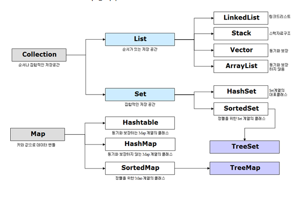

* 스트림은 위와 같은 데이터 컬렉션 반복, 추출등 멋지게 처리하는 기능.
  * Stream : **데이터 처리 연산을 지원하도록 소스에서 추출된 연속된 요소**
  * 여기서 데이터 처리 연산은 뭘까?
    * 함수형 프로그래밍 언어에서 일반적으로 지원하는 것과 비슷함. filter, map, reduce, find, sort 등등..
    * 컬렉션, 배열, I/O 자원 등의 데이터 제공 소스로부터 데이터를 소비함.
    * 즉, 컬렉션의 주제는 데이터이고, 스트림의 주제는 계산이라고 할 수 있음.
* 배열이나 컬렉션 등에 대한 여러 가지 연산들의 처리를 추상화(일관성 있게함)하여 동일한 방식으로 연산될 수 있도록 도와줌.
* 한번 생성하고 사용한 스트림은 다시 생성해야함.

```java
import java.util.Arrays;
import java.util.stream.IntStream;

public class IntArrayStreamTest {

	public static void main(String[] args) { 
		
		int[] arr = {1,2,3,4,5};
		
		// 주로 사용하던 방식
		for(int n : arr) {
			System.out.print(n + " ");
		}
		System.out.println();
		// Arrays class의 .stream 생성의 forEach 를 사용하면 하나씩 꺼낼 수 있음.
		// forEach 안에는 임의의 변수 n이 하나씩 출력되도록.
		Arrays.stream(arr).forEach(n -> System.out.print(n + " "));
		
		System.out.println();
		// IntStream에는 여러가지 기능들이 있음.
		// is를 재활용할 수는 없음. 연산 후 소모되기떄문에.
		IntStream is = Arrays.stream(arr);
		is.forEach(n -> System.out.print(n + " "));
		
		// 재사용하려면 또 다른 선언을 해줘야함.
		int sum = Arrays.stream(arr).sum();
		System.out.println(sum);
	}
}
```

* Arrays의 stream에는 다양한 함수들이 있어 직접 사용해보면서 알아가야함.
* forEach가 가장 유용하게 쓰이는 듯?

#### 결과
```
1 2 3 4 5 
1 2 3 4 5 
1 2 3 4 5 
15
```

* 스트림은 중간 연산과 최종 연산으로 나눌 수 있음.
* 중간 연산은 ex) filter(), map(), sorted() 로 조건에 맞는 요솔를 추출(filter) 하거나 반환(map)함.
* 최종 연산 ex) forEach() 이 호출될 때 중간 연산이 수행되고 결과가 생성됨.

#### filter, map, sorted 사용예제

```java
import java.util.ArrayList;
import java.util.List;
import java.util.stream.Stream;

public class ArratyListStreamTest {

	public static void main(String[] args) {

		List<String> list = new ArrayList<String>();
		
		list.add("son");
		list.add("ji");
		list.add("soo");
		
		// 콜렉션(지금은 list)은 다 스트림을 호출 할 수 있음.
		Stream<String> stream = list.stream();
		stream.forEach(s -> System.out.print(s + " "));
		
		System.out.println();
		
		// filter 사용
		Stream<String> isS = list.stream();
		isS.filter(s -> s.contains("s")).forEach(n -> System.out.print(n + " "));
		
		System.out.println();
		
		// sorted 사용
		Stream<String> isSorted = list.stream();
		isSorted.sorted().forEach(s -> System.out.print(s + " "));
		
		System.out.println();
		// map 사용 객체를 선언하지 않고도 익명클래스가 숨어있기 때문에 아래와 같이 사용 가능.
		list.stream().map(s -> s.length()).forEach(n -> System.out.print(n + " "));
	}
}
```

#### 결과
```
son ji soo 
son soo 
ji son soo 
3 2 3 
```

> 스트림이란???  **배열, 컬렉션등을 사용할 때 편리한 연산을 수행하도록 도와주는 것.**    
> 익명 객체이기때문에 한번 사용하고나서 재선언해서 사용해야함.

#### reduce() 연산

* 정의된 연산이 아닌 프로그래머가 직접 구현한 연산을 적용할 때 reduce() 사용함.

```java
import java.util.Arrays;
import java.util.function.BinaryOperator;

class CompareString implements BinaryOperator<String> {

	// 두 매개변수 s1, s2는 위에서 정의한 제네릭<String> 값을 그대로 받아옴.
	@Override
	public String apply(String s1, String s2) {
		if(s1.getBytes().length >= s2.getBytes().length ) {
			return s1;
		}
		else {
			return s2;
		}
	}
	
}

public class ReduceTest {

	public static void main(String[] args) {
		
		// 람다식으로 직접 reduce 사용하는 방법
		String[] greetings = {"Hello", "Java", "이게 제일 기려나", "it's very long sentence."};
		
		System.out.println(Arrays.stream(greetings).reduce("", (s1, s2) -> {
				if(s1.getBytes().length >= s2.getBytes().length ) {
					return s1;
				}
				else {
					return s2;
				}
			})
		);
		
		System.out.println();
		
		// BinaryOperator 인터페이스 구현
		String str = Arrays.stream(greetings).reduce(new CompareString()).get();
		System.out.println(str);
	}
}
```

#### 결과

```java
it's very long sentence.

it's very long sentence.
```

* BinaryOperator를 사용한 클래스를 .reduce(new CompareString()) 으로 사용함으로써 apply 부분이 호출되며 수행됨.
* 람다식이 길어지면 BinaryOperator 를 구현해보자.

#### 예제 활용

```java
import java.util.ArrayList;
import java.util.List;

public class CustomerTest {

	public static void main(String[] args) {

		Customer customerS = new Customer("Son", 29, 100);
		Customer customerP = new Customer("Park", 19, 60);
		Customer customerH = new Customer("Hong", 42, 150);
		
		List<Customer> list = new ArrayList<Customer>();
		list.add(customerS);
		list.add(customerP);
		list.add(customerH);
		
		// 총 비용 계산
		int totalCost = list.stream().mapToInt(n -> n.getCost()).sum();
		System.out.println(totalCost);
		
		// 고객 중 20세 이상 정렬하여 계산
		list.stream().filter(s -> s.getAge() >= 20).map(c -> c.getName()).sorted().forEach(r -> System.out.println(r));
	}
}
```

* Customer Class 에는 name, age, cost 를 private로 선언 후에 이용.
* 위와 같이 총 비용 계산, filter, map, sorted, forEach 를 통해 배열은 stream을 통해 쉽게 계산이 가능함.
BufferedReader
</div>
</details>

<details>
<summary style="font-size:20px">BufferedReader, BufferedWriter</summary>
<div markdown="1">

#### 개요

* 백준 알고리즘 문제 풀면서 Scanner 를 사용할 떄 **시간초과** 발생하는 문제가 발생했는데 BufferedReader를 써야된다고 들음.
* why?
  * Scanner는 입력을 읽는 과정에서 정규표현식을 적용(Scanner 를 타고 들어가면 볼 수 있음), 분할, 파싱을 직접 제공함.
  * 반면에 BufferedReader는 모든 입력을 Char형으로 버퍼를 사용하여 받으므로, 하나의 글자가 아닌 전체 입력에 대해서 전달되므로 속도가 빠름.
  
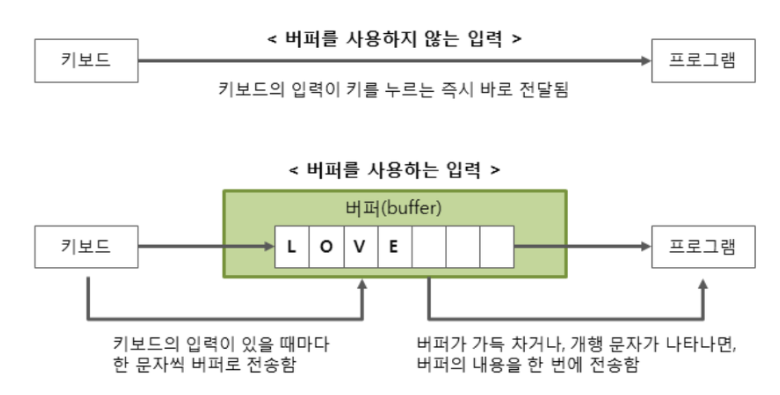

#### BufferedReader

* 그래서 BufferedReader 의 Buffer 와 Reader는 뭘까?
  * **Buffer** : 데이터가 전송될 때 일시적으로 저장되는 메모리 영역.
  * ex) 지하철에 비교했을 때 매번 사람들이 들어올 때마다 이동하는게 아닌 어느정도 사람이 모이고 지하철이 와야 이동이 가능한 점.
  * buffer를 사용하면 문자를 묶어서 한 번에 전달하므로 성능이 향상되고, 사용자가 문자를 잘못 입력했을 경우 수정할 수 있음.

#### 사용방법

```java
BufferedReader br = new BufferedReader(new InputStreamReader(System.in));
int userInputNumber = Integer.parseInt(br.readLine());
```

* BufferedReader는 String 타입만을 다루기 때문에 int형은 형변환이 필요함.
* Stream ?? 자바에서 나온 스트림인지?
  * 여기서 스트림은 파일을 읽거나 쓸 때, 데이터가 전송되는 통로라고 생각.
* 즉 BufferedReader는 **Byte타입으로 전송되는 데이터를 Char형으로 변환하고, 다시 버퍼링을 적용하여 Char 데이터를 반환해주는 과정**

#### BufferedWriter

```java 
BufferedWriter bw = new BufferedWriter(new OutputStreamWriter(System.out)); // 선언
bw.write("Hello World");
bw.flush(); // write로 담은 내용 출력 후, 버퍼를 비움.
bw.close(); 
```

* BufferedWriter에서 사용되는 메소드는 write(), flush(), close() 세 가지가 있음.
* write()로 출력할 내용을 담고, flush() 로 버퍼를 비워내는 동시에 콘솔을 출력함.
* flush? 왜할까?
  * output stream의 실행으로 버퍼 되었다면, 버퍼된 바이트는 즉시 사용될 목적으로 쓰여져야함.
  * 즉, 스트림을 닫지 않은 상태에서 바이트를 보내고 싶은 경우에 플러쉬를 사용함.

</div>
</details>

<details>
<summary style="font-size:20px">예외 처리</summary>
<div markdown="1">

#### 개요

* try, catch 또는 exception 처리 하여 프로그램에서의 오류 처리 코드를 짜봤었음.
* 개념, 원리, 다른 방법을 좀 더 자세히 알아보기위함.

#### 예외처리

* 에러는 크게 컴파일 에러(문법 구문 오류), 런타임 에러(프로그램 실행 중 발생), 논리적 에러(시스템상 버그) 세 가지로 나뉨.
 
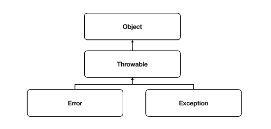

* 실행 시 발생할 수 있는 오류를 두 가지로 구분.
  * 에러 : 프로그램 코드에 의해서 수습될 수 없는 심각한 오류(OutOfMemoryError, StackOverFlowError) 
  * 예외 : 프로그램 코드에 의해서 수습될 수 있는 미약한 오류

* 에러는 대처하기 어렵지만 예외는 구현한 로직에 대응 코드를 작성해놓음으로써 비정상적인 종료 혹은 동작을 막을 수 있음.
* 주로, Exception 클래스 또는 try-catch 문법을 사용함.

#### Exception 클래스


* Error 클래스는 는 자주 보지 못했지만 Exception 익숙한 에러가 많음...
* 정말 자주 보던 IndexOutofBoundsException, RuntimeException..NullPointException 등등
* 위 그림을 심플하게 요약하자면 아래 그림과 같음.

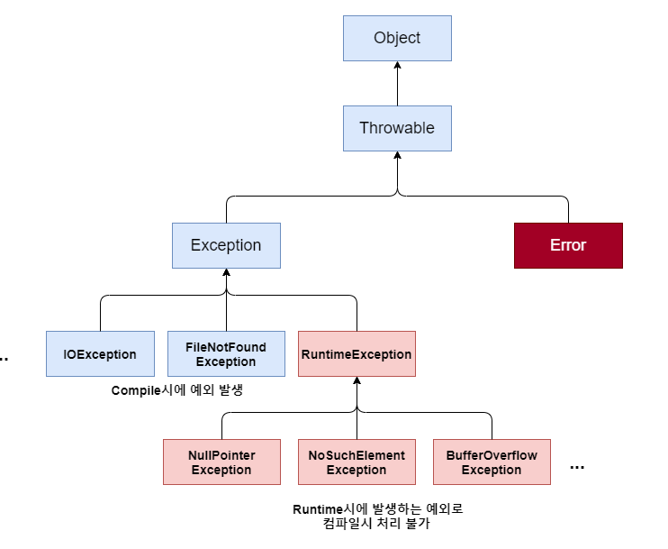

* Exception 클래스는 다시 RuntimeException(런타임 에러)와 그 외의 클래스 그룹(컴파일 에러)로 나뉨.

* Exception 및 하위 클래스 : 사용자의 실수와 같은 외적인 요인에 의해 발생하는 컴파일 에러
  * 존재하지 않는 파일의 이름 입력 (FiltNotFoundException)
  * 클래스 이름 잘못 기재 (ClassNotFoundException)
  * 입력한 데이터 형식 불일치 (DataFormatException)
* RuntimeException : 프로그래머의 실수로 발생하는 예외
  * 배열의 범위를 벗어남 (IndexOutOfBoundsException)
  * 값이 null인 참조 변수 멤버 호출 (NullPointerException)
  * 클래스 간의 형 변환 잘못함 (ClassCastException)

#### 예제

```java
public class ArrayIndexException {
	
	public static void main(String[] args) {
		
		int[] arr = {1, 2, 3, 4, 5};

		/*
		 * 간단한 try catch문
		 * 오류는 나지만 비정상적인 종료는 일어나지 않음.
		 */
		try {
			for(int i=0; i<arr.length+1; i++) {
				System.out.println(arr[i]);
			}	
		}catch (ArrayIndexOutOfBoundsException e) {
			System.out.println(e.getMessage());
			System.out.println(e.toString());
		}
	}
}
```

* 가장 기본적인 try catch 형식이며 오류를 확인하거나 시스템의 비정상적인 종료를 막아줌.

```java
try {
    fis = new FileInputStream("a.txt");
} catch (FileNotFoundException e) {
    e.printStackTrace();	// 에러가 난 지점을 알려줌
} finally {
    try {
        fis.close();
    } catch (IOException e) {
        e.printStackTrace();
    }
    System.out.println("finally");
}
System.out.println("end");
```

* 실무에서 파일 관리를 할 때 가장 많이 사용했던 코드.
* catch에서 에러가 잡혀도 finally 쪽은 실행이 됨.

#### 다중 예외 처리 

```java
import java.io.FileInputStream;
import java.io.FileNotFoundException;

public class ThrowsException {

	public Class loadClass(String fileName, String className) throws ClassNotFoundException, FileNotFoundException {
		
		FileInputStream fis = new FileInputStream(fileName);
		Class c = Class.forName(className);
		return c;
	}
	
	public static void main(String[] args) {

		ThrowsException test = new ThrowsException();
		
		try {
			test.loadClass("a.txt", "java.lang.String");
		} catch (ClassNotFoundException e) {
			System.out.println(e);
		} catch (FileNotFoundException e) {
			System.out.println(e);
		} catch( Exception e) {
			// default 처리 자동 형변환되어 최상위에서 불리어짐. 맨 위에서 사용 불가.
			e.printStackTrace();
		}
		System.out.println("end");
	}
}
```
 
* try catch가 방법이 아닌 Main에서 실제로 사용할 때는 아래와 같이 사용할 수 있음.
* 최상위 클래스인 Exception 클래스를 사용할 때는 최상위 클래스이므로 맨 위에서는 사용 불가함.
* 각각의 Exception 이 발생하지 않거나, 정상적으로 발생하면 end 가 표시됨.

</div>
</details>

<details>
<summary style="font-size:20px">I/O 스트림</summary>
<div markdown="1">

#### I/O 스트림 정의

* I/O 스트림은 뭘까 ??
  * I/O 란???
    * Input/Ouput 의 약어로 내부 또는 외부 장치와 프로그램 간의 데이터를 전송가능케 하는 지점이라고함.
  * Stream이란??
    * 운영체제에 의해 생성되는 가상의 연결고리라고도 함.
    * 물이 한 뱡향으로 연속적인 흐름을 가지는 형태.(단뱡향 형태)
    * 먼저 입력된 데이터가 먼저 출력되는 형태(Queue 의 자료구조와 같은 FIFO)
    * 즉, 데이터를 운반하는 연결통로

#### I/O 스트림 구조

### 입력 스트림과 출력 스트림 

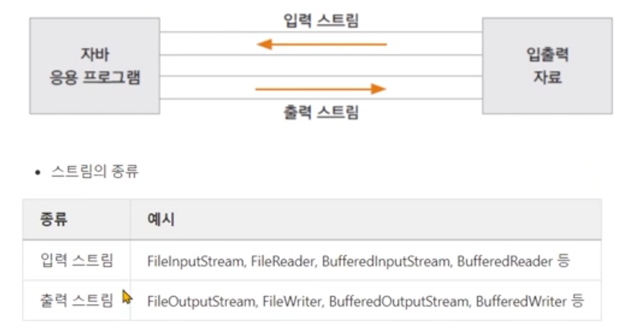

### 입출력 스트림 예제

```java
import java.io.IOException;
import java.io.InputStreamReader;

public class SystemInTest11 {

	public static void main(String[] args) {
		
		System.out.println("알파벳 여러 개를 쓰고 [Enter] 입력 ");
		
		int i;
		
		try {
			while((i = System.in.read()) != '\n') {
				System.out.print((char)i);
				// 1Byte씩 읽는데 한글 입력하면 2Byte이므로 깨짐 현상.
				// System.in 은 보조 스트림으로 감싸야 한글 처리 가능함.
			}
		} catch (IOException e) {
			e.printStackTrace();
		}
		
		System.out.println();
		int j;
		
		try {
			// Byte를 문자로 바꿔주는 함수, 매개변수로 Byte단위를 받음
			InputStreamReader irs = new InputStreamReader(System.in);
			while((i = irs.read()) != '\n') {
				System.out.print((char)i);
			}
		} catch (Exception e) {
		}
	}
}
```

* read를 통해 읽으면 1byte씩 읽게됨.
* 위의 try catch 문에서 한글을 입력하게 되면 깨짐
  * why??
  * 1바이트씩 읽는데 한글은 2바이트를 읽으므로 꺠짐. 
  * System.in 은 스트림으로 되어있어 보조 스트림으로 감싸서 사용해야함.
* 밑에 try catch 문에서 한글을 입력하면 깨지지 않음
  * InputStreamReader는 Byte를 문자로 받기 때문에 한글을 입력해도 깨지지 않음.
  * 지금은 System.in 을 매개변수로 사용하고 있는데 파일 InputStream을 감싸면 파일에 있는 한글을 읽을 수가 있음.
  
### 바이트 단위 스트림과 문자 단위 스트림

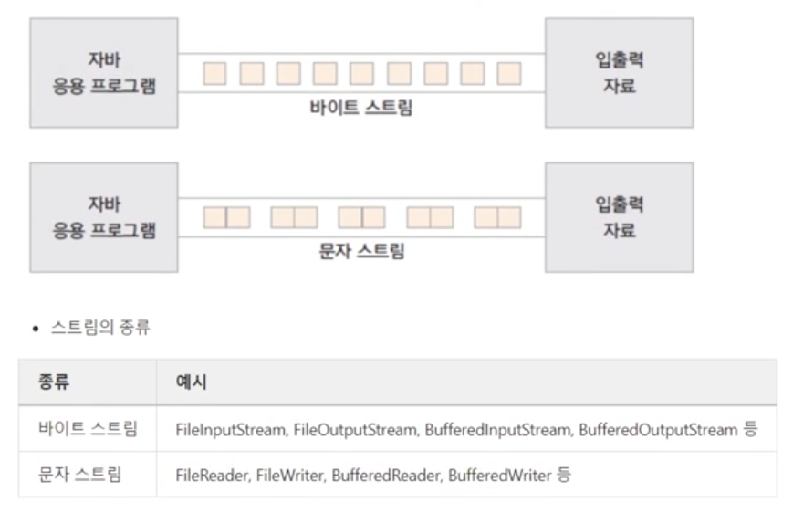

* FileInputStream은 가장 많이 사용됨. 실제로 실무에서도 몇 번 사용함.
* FileInputStream 사용방법을 예제를 통해 알아보자.

### FileInputStream 바이트 단위 입출력 스트림 예제

```java
import java.io.FileInputStream;
import java.io.IOException;

public class FileInputStreamTest1 {

	public static void main(String[] args) {
		
		FileInputStream fis = null;
		try {
			fis = new FileInputStream("input.txt");
			// 세 개를 읽어보고 출력해봄
			System.out.println((char)fis.read());
			System.out.println((char)fis.read());
			System.out.println((char)fis.read());
		} catch (IOException e) {
			e.printStackTrace();
		} finally {
			try {
				fis.close();
			} catch (IOException e) {
				e.printStackTrace();
			} catch (Exception e2) {
				// null 일 수도 있으므로 주석 처리시 맨 밑에 end가 안찍힘.
				System.out.println(e2);
			}
		}
		System.out.println("end");
		
	}
}
```
* Byte로 값을 읽는 FileInputStream 에서 input.txt 파일을 읽어보려고 함.
  * input.txt 안에 값이 있으면 하나의 byte씩 읽어서 출력해라.
  * input.txt 파일이 없을 때 IOException 문으로 이동. (사실 FileNotFoundException 인데 기억이 안나는 경우 IOException가 상위이므로 넣어줘도 무관함)
  * IOException 에서 null인데 close를 하는 경우 오류가 발생하므로 한번 더 Exception 으로 감싸줌.

### FileInputStream 바이트 단위 입출력 배열로 읽기

```java
import java.io.FileInputStream;
import java.io.FileNotFoundException;
import java.io.IOException;

public class FileInputStreamTest2 {

	public static void main(String[] args) {
		
		int i;
		try(FileInputStream fis = new FileInputStream("input2.txt")) {
			
			byte[] bs = new byte[10];
			
			while((i = fis.read(bs)) != -1) {
				
				for(int ch : bs) {
					System.out.print((char)ch);
				}
				System.out.println(" : " + i + "바이트 읽었음");
			}
		} catch (IOException e) {
			e.printStackTrace();
		}
	}
}
```

### 결과

```
ABCDEFGHIJ : 10바이트 읽었음
KLMNOPQRST : 10바이트 읽었음
UVWXYZQRST : 6바이트 읽었음
```
* input2.txt 에 써져있는 A~Z문자를 읽어보자.
  * byte배열에 길이가 10개인 배열을 생성
  * int i는 바이트 수를 반환하므로 -1일때는 EOF 이므로 -1이 아닐 때까지 반복함.
  * bs에 담긴 배열의 길이 만큼 int ch를 읽는데 읽을 때는 문자로 나올 수 있도록 (char)ch 를 통해 읽어주자.

* 여기서 결과를 자세히보면 맨마지막 UVWXYZQRST 에서 Z에 + QRST가 붙어있다 왜 붙어있을까??
  * 버퍼에 데이터가 남아있기 때문임 버퍼를 클리어(flush)하거나 배열의 길이만큼만 읽으면 해결 가능함.

### FileOutputStream 바이트 단위 입출력 스트림 예제

* FileOutputStream은 FileInputStream 과 같이 사용되기에 함께 알아야함.
* FileOutputStream은 사용방법을 예제를 통해 알아보자.

```java
 import java.io.FileOutputStream;
import java.io.IOException;

public class FileOutputStreamTest2 {
	
	public static void main(String[] args) {
		
		try(FileOutputStream fos = new FileOutputStream("output.txt")){

			fos.write(65);
			fos.write(66);
			fos.write(67);
		} catch (IOException e) {
			System.out.println(e);
		}
		System.out.println("end");
	}
}
```

* FileInputStream을 통해 흐름을 파악하고 나니 OutputStrema도 유사하다는 것을 알 수 있었음.
* try문이 실행되면 byte단위로 65, 66, 67 을 읽어서 output.txt 를 생성함. 결과는 ABC 로 잘나옴.

### FileOutputStream 바이트 단위 입출력 배열로 읽기

```java
import java.io.FileOutputStream;
import java.io.IOException;

public class FileOutputStreamTest2 {
	
	public static void main(String[] args) throws IOException {
		
		FileOutputStream fos = new FileOutputStream("outputArray.txt");
		try(fos){
			
			byte[] bs = new byte[26];
			byte data = 65;
			for(int i=0; i<bs.length; i++) {
				bs[i] = data;
				data++;
			}
			
			fos.write(bs);
		} catch (IOException e) {
			System.out.println(e);
		}
		System.out.println("end");
	}
}
```

* OutputSream 배열 역시 유사한 방식.
* 알파벳 사이즈 26만큼 배열 생성
* 초기값에 65(A) 를 넣어줌.
* 26의 길이만큼 1씩 증가할 때마다 65에서 1씩 증가하므로
* outputArray.txt에는 A~Z 알파벳이 정상적으로 입력됨.

### 문자 단위 입출력 스트림

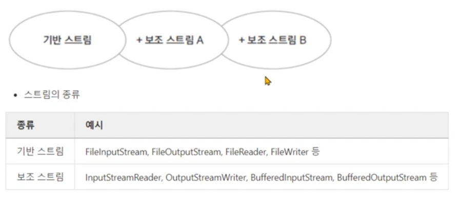

* 바이트 단위 입출력 스트림에 대해서 알아보았으니 이번엔 문자 단위는 어떻게 하는지 알아보자.

### 문자 단위 입출력 스트림 예제 

```java
import java.io.FileWriter;
import java.io.IOException;

public class FileWriterTest {

	public static void main(String[] args) {

		try(FileWriter fw = new FileWriter("writer.txt")){
			fw.write('A');    // 문자 하나 출력
			char buf[] = {'B','C','D','E','F','G'};
			
			fw.write(buf); //문자 배열 출력
			fw.write("안녕하세요. 잘 써지네요"); //String 출력
			fw.write(buf, 1, 2); //문자 배열의 일부 출력
			fw.write("65");  //숫자를 그대로 출력
		}catch(IOException e) {
			e.printStackTrace();
		}
		
		System.out.println("출력이 완료되었습니다.");
	}
}
```

```java
import java.io.FileReader;
import java.io.IOException;

public class FileReaderTest {
	
	public static void main(String[] args) {
		
		try {
			FileReader fr = new FileReader("reader.txt");

			int i;
			
			while((i = fr.read()) != -1) {
				System.out.print((char)i);	
			}
		} catch (IOException e) {
			e.printStackTrace();
		}
	}
}
```

* 타이핑을 안보고 직접 치다보니 FileReader, FileWriter 같은 경우는 이제 쉽게 작성할 수가 있음.
* Byte를 쓸 때는 FileInputStream, FileOutputStream 
* 문자 단위를 입출력 할 때는 FileReader, FileWriter 를 사용하자.

</div>
</details>

<details>
<summary style="font-size:20px">직렬화</summary>
<div markdown="1">

#### 직렬화 

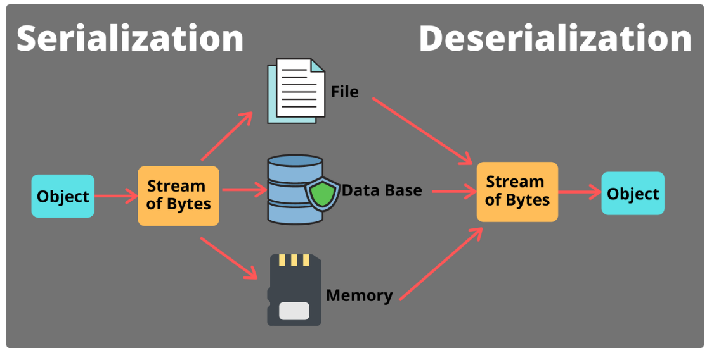

* 자바 시스템 내부 or 외부에서 사용되는 객체 또는 데이터를 바이트 형태로 변환하는 기술.
* 직렬화는 왜 써야될까??
	* 휘발성이 있는 캐싱 데이터를 영구 저장 필요할 때 사용할 수 있음.
	* ex) 객체가 인스터스화 돼면 값이 변함. -> 그 상태 그대로의 데이터를 영구 저장이 필요할 떄.
	* 즉, 시스템이 종료되더라도 나중에 다시 재사용할 필요성이 있을 때 사용함.

### Serailization 예제

```java
import java.io.FileInputStream;
import java.io.FileOutputStream;
import java.io.IOException;
import java.io.ObjectInputStream;
import java.io.ObjectOutputStream;

class Person implements Serializable{
	
	String name;
	String job;
	
	public Person() {
		
	}
	
	public Person(String name, String job) {
		this.name = name;
		this.job = job;
	}
	
	public String toString() {
		return name + "," + job;
	}
}

public class SerializationTest {

	public static void main(String[] args) {
		
		Person personLee = new Person("Lee", "대표이사");
		Person personSon = new Person("Son", "대표");
		
		try(FileOutputStream fos = new FileOutputStream("serial.txt");
				ObjectOutputStream oos = new ObjectOutputStream(fos)){
			
			oos.writeObject(personLee);
			oos.writeObject(personSon);
			
		}catch (Exception e) {
			
			System.out.println(e);
		}
		
		// Input
		try(FileInputStream fis = new FileInputStream("serial.txt");
				ObjectInputStream ois = new ObjectInputStream(fis)){
			
			// class에 대한 정보가 없는 경우 classNotFoundException 발생
			Person pLee = (Person)ois.readObject();
			Person pSon = (Person)ois.readObject();
			
			System.out.println(pLee);
			System.out.println(pSon);
			
		}catch (IOException e) {
			
			System.out.println(e);
		}catch (ClassNotFoundException e2){
			System.out.println(e2);
		}
	}
}
```

* Class Person implements Serializable 구현 코드는 없으나 이 객체가 직렬화 가능하다는 마크업 인터페이스임.
* FileOutputStream을 통해 serial.txt 를 씀. oos.writeObject -> Serializtion(직렬화)
* 그 다음 FileInputStream을 통해 serial.txt 를 읽음. 역직렬화기능. 
* serial.txt 를 열어보면 정보를 쓸 때 읽을 수 없는 코드로 보이나, 정보들을 다시 역직렬화를 통해 복원화함.

```java
String name;
transient String job;
```

* 직렬화하다보면 직렬화가 안되는 (Socket)과 같은 것들을 가지고 있는 경우 
* Class에서 직렬화할 수 없는 멤버를 갖고 있는데 Class를 직렬화하고자하면 해당 변수에 transient 를 붙여주면됨.
  * 해당 멤버는 무시하고 직렬화를 진행함.
  * 복원할 때 넣어주는 값은 default 값인 null을 반환해줌.

> 직렬화라는 것은 인스턴스값을 그대로 저장하거나 전송하고 저장된 값을 복원하는 경우를 직렬화라고함.
> 사용하지 못하는 변수는 transient 를 사용하자.

</div>
</details>

<details>
<summary style="font-size:20px">Thread</summary>
<div markdown="1">

#### 개요

* 프로세스를 구성하는 단위??, 프로세스의 자원을 공유해서 메모리 낭비를 막아준다? 
* 프로세스를 복제할 때 fork 하면 여러 개의 동일한 프로세스가 복제되어 메모리가 낭비됨.  
* 하지만 쓰레드는 프로세스의 자원(힙, 메모리, 스택 영역 메모리)을 공유하기 때문에 메모리 낭비를 막아줌.
* 쓰레드 개념을 위의 정도로 알고있으나 실무에서 사용한 적이 없어서 감이 잘안오기에 다시 한 번 재정리해보자.

#### Thread 예제

```java
 class MyThread extends Thread{
	
	public void run() {
		
		int i;
		for(i=1; i<=200; i++) {
			System.out.print(i + "\t");
		}
	}
}

public class ThreadTest {

	public static void main(String[] args) {
		
		System.out.println( Thread.currentThread() + "start");
		MyThread th1 = new MyThread();
		MyThread th2 = new MyThread();
		
		th1.start();
		th2.start();
		System.out.println( Thread.currentThread() + "end");

		// 익명 객체로도 실행 가능함.
		Runnable run = new Runnable() {
			
			@Override
			public void run() {
				System.out.println("익명으로 실행");
			}
		};
		run.run();
	}
}
```

* 쓰레드는 Thread를 상속해서 사용하는 방법, Runnable을 구현해서 사용하는 방법 두 가지가 있음.
* Thread 를 run 하면 1부터 200까지의 로직을 수행됨.
* Thread를 호출 하려면 객체를 생성하고 객체.start() 를 호출해서 사용가능함.
* 간단하게 돌릴 경우에는 아래 예제처럼 익명 객체를 생성해서 바로 호출도 가능함.

### Thread Status

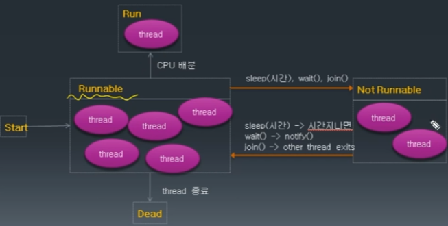

* Thread가 시작이면 Thread 풀에 들어옴.(CPU를 배분 받으려고 기다리는 상태 -> Runnable)
* 언제든지 CPU를 배분받으면 실행될 수 있음. 실행되고 끝나면 Thread가 종료되며 Dead.
* Not Runnable 상태는 CPU를 점유할 수 없는 상태임.
  * Not Runnable 상태로 가려면 sleep, wait, join 세 가지가 있음.
  * 리소스가 유효하면 notify 를 진행하면, 다시 Runnable 상태로 돌아갈 수 있음.
* join은 두 개의 쓰레드가 돌면서 1개의 쓰레드가 수행되려고하면 다른 한 개의 결과가 필요한 경우임.
  * join을 걸면 자기 자신이 Not Runnable 상태가 됨.
  * 다른 한 개의 쓰레드가 끝나면 Runnable 상태로 돌아갈 수 있음.

### synchronized 

* multe-thread로 동기화를 제어하는 경우 사용.
* 하나의 프로세스가 간섭하지 못하게 해당 프로세스만 진행하고 수행하도록 하는 것.
* 즉, multi-thread로 동시접근되는 것을 막는다는의미.

```java
public class MyHero {
	private String mHero;
	
	public static void main(String[] agrs) {
		MyHero tmain = new MyHero();
		System.out.println("Test start!");
		new Thread(() -> {
			for (int i = 0; i<1000000; i++) {tmain.batman();}			
		}).start();
		
		new Thread(() -> {
			for (int i = 0; i<1000000; i++) {tmain.superman();}
		}).start();
		System.out.println("Test end!");
		
	}
	
	public synchronized void batman() {
		mHero= "batman";
		
		try {
			long sleep = (long) (Math.random()*100);
			Thread.sleep(sleep);
			if ("batman".equals(mHero) == false) {
				System.out.println("synchronization broken");
			}
		} catch (InterruptedException e) {
			e.printStackTrace();
		}
	}
	
	public synchronized void superman() {
		mHero = "superman";
		
		try {
			long sleep = (long) (Math.random()*100);
			Thread.sleep(sleep);
			if ("superman".equals(mHero) == false) {
				System.out.println("synchronization broken");
			}
		} catch (InterruptedException e) {
			e.printStackTrace();
		}
	}
}
```

* synchronized 함수가 두 개인 MyHero 클래스 객체 생성을 함.
* 두 개의 Thread가 객체의 synchronized 함수인 batman() 과 superman() 각각 백만번 호출함.
* batman(), superman() 함수는 mHero란 멤버변수에 각각 다른 값을 세팅하고, 랜덤하게 sleep한 후에 값이 변했는지 체크함.
* 값이 변했다면 synchronization broken 을 찍음.
* 즉, synchronized 함수는 자신이 포함된 객체에 lock을 건다. 라고 생각하며 이를 해결하기 위해서는 동기화 block 을 사용하면됨.

```java
public class SyncBlock1 {
	public ArrayList<Integer> mList = new ArrayList<>();	
	
	public static void main(String[] agrs) throws InterruptedException {
		SyncBlock1 syncblock1 = new SyncBlock1();
		System.out.println("Test start!");
		Thread t1 = new Thread(() -> {
			for (int i = 0; i<10000; i++) {syncblock1.add(i);}			
		});
		
		Thread t2 = new Thread(() -> {
			for (int i = 0; i<10000; i++) {syncblock1.add(i);}
		});
		
		t1.start();
		t2.start();
		
		t1.join();		
		t2.join();
		
		System.out.println(syncblock1.mList.size());
		System.out.println("Test end!");
		
	}
	
	public void add(int val) {
		/*
		 * Code for synchronization is not needed
		 * 
		 */
		synchronized(this) {
			if (mList.contains(val) == false) {
				mList.add(val);				
			}			
		}
	}
}
```

* 위의 예제와 같이 내부에 동기화가 필요한 부분에 대해서만 synchronized 블록을 활용.
* Code for synchronization is not needed 주석으로 표시해놓은 곳에 동기화가 필요없는 다른 코드를 넣으면됨.
</div>
</details>

<details>
<summary style="font-size:20px">Java var</summary>
<div markdown="1">

#### 개요 

* Java10부터 도입된 var 에 대해 알아보기위함.

#### Java var 사용방법

* var는 변수를 선언할 떄 타입을 생략할 수 있으며, 컴파일러가 타입을 추론합니다.

```java
var String = "Hello, World!";
```

* 위와 같이 변수를 선언하면 컴파일러가 String 타입을 추론하며 지정해줍니다.
* Js와 Kotlin 과 같은 언어 타입.
* 컴파일 타임에 추론하는 것이기 때문에, Runtime에 추가 연산을 하지 않아서 성능에 영향을 주지는 않습니다.
* var 의 기본 사용방법 및 제약사항에 대해서 알아보겠습니다.

* Java 9 이하에서는 문자열을 선언할 때 다음과 같이 타입을 명시적으로 선언해야 했습니다.

```java
String str = "Hello world";
```

* Java 10에서는 다음과 같이 var로 타입 선언 없이 문자열을 선언할 수 있습니다.

```java
var str = "Hello world";

if(str instanceof String){
	System.out.println("This is a String : " + str);
}

var list = new ArrayList<String>();

if (list instanceof ArrayList) {
    System.out.println("This is a ArrayList");
}

int[] arr = {1, 2, 3};

for (var n : arr) {
    System.out.println("n : " + n);
}
```

#### Java var 제약사항

1. **지역 변수에서만 사용가능**합니다.

* 아래와 같이 클래스의 멤버 변수를 선언할 때는 사용할 수 없습니다.

```java
class JavaLocalVariable {

    public var str = "aaa";    // compile error

    public var list = new ArrayList<String>();    //compile error
}
```

2. **초기화 필요**

```java
var n; // compile error
```

* 초기화를 하지 않으면 어떤 타입인지 추론할 수 없기 때문에 컴파일 에러가 발생합니다.

3. **null로 초기화할 수 없음**

```java
var map = null; // compile error
```

* 어떤 객체든 null이 할당될 수 있기 때문에, 타입 추론을 할 수 없으며 컴파일 에러가 발생합니다.

4. **배열에 사용할 수 없음**

```java 
var arr = { 1, 2, 3 };    // compile error
```

* 배열을 사용할 때도 타입 추론을 못하기 때문에 명시적으로 타입을 정해줘야 합니다.

5. **Lambda에 사용할 수 없음**

```java
var f = () -> { };    // compile error
```

</div> 
</details>


<details>
<summary style="font-size:20px">불변 객체</summary>
<div markdown="1">

### 불변 객체

* 객체의 상태(객체 내부의 값, 필드, 멤버 변수) 가 변하지 않는 객체를 불변 객체라고 합니다.
* 객체의 값을 변경할 때 생기는 문제점을 해결하기 위해 불변 객체를 사용합니다.
* 사용방법은 아래와 같습니다.

```java
public class ImmutableAddress {

    private final String value;

    public ImmutableAddress(String value) {
        this.value = value;
    }

//    public void setValue(String value){
//        this.value = value;
//    }
    
    public String getValue() {
        return value;
    }

    @Override
    public String toString() {
        return "ImmutableAddress{" +
                "value='" + value + '\'' +
                '}';
    }
}
```

* 위에 코드 예제에서 볼 수 있듯이 멤버 변수를 final로 지정함으로써 setValue를 사용하지 못하게하여 객체의 값을 변경하지 못하는 불변 객체로써 사용합니다.
* 불변 객체의 값을 변경하고 싶다면 새로운 불변 객체를 생성해야하고 이렇게 함으로써 기존 변수들에 영향을 주지는 않습니다.

#### 불변 객체 사용 예제

```java
public class ImmutableMyDate {
    private final int year;
    private final int month;
    private final int day;

    public ImmutableMyDate(int year, int month, int day) {
        this.year = year;
        this.month = month;
        this.day = day;
    }

    public ImmutableMyDate withYear(int newYear) {
        return new ImmutableMyDate(newYear, month, day);
    }
    public ImmutableMyDate withMonth(int newMonth) {
        return new ImmutableMyDate(year, newMonth, day);
    }
    public ImmutableMyDate withDay(int newDay) {
        return new ImmutableMyDate(year, month, newDay);
    }

    @Override
    public String toString() {
        return year + "-" + month + "-" + day;
    }
}

public class ImmuableMyDateMain {
    public static void main(String[] args) {

        ImmutableMyDate date1 = new ImmutableMyDate(2024, 9, 16);
        ImmutableMyDate date2 = date1;

        System.out.println("date1 = " + date1);
        System.out.println("date2 = " + date2);

        System.out.println("2025 - > date1");
        date1 = date1.withYear(2025);
        System.out.println("date1 = " + date1);
        System.out.println("date2 = " + date2);
    }
}
```

* 위의 코드와 같이 사용하면 원본 객체의 상태는 그대로 유지되고 변경사항은 새 복사본에 포함하여 불변 객체로써 사용가능합니다.
* 불변의 값을 변경하고 싶을 때는 새로운 객체를 만들어서 반환하여 사용합니다.
* 불변을 사용함으로써 date1, date2 를 독립적으로 사용하여 사이드 이펙트라는 큰 문제를 막을 수 있습니다.
* 불변으로 설계하는 이유는 아래와 같은 세 가지의 장점도 존재합니다.
	* 캐시 안전성
	* 멀티 쓰레드 안전성
	* 엔티티의 값 타입 

</div> 
</details>

<details>
<summary style="font-size:20px">Wrapper Class</summary>
<div markdown="1"> 

### 래퍼 클래스 기본형 차이

* 기본형은 객체가 아니므로 아래와 같은 단점을 가지고 있습니다.
	* 객체가 아니므로 메서드 사용 불가.
	* null값을 가질 수 없음.
* 래퍼 클래스는 불변이며 값 비교시 equals 를 통해 비교해야 합니다.

```java
public class wrapper{
	public static void main(String[] args){
		int value = 7;
		// 기본형 -> 래퍼 클래스
		Integer boxedValue = Integer.valueOf(value);
		// 래퍼클래스 -> 기본향
		int unboxedValue = boxedValue.intValue();

		// 오토 박싱, 오토 언박싱
		Integer boxedValue2 = value;
		int unboxedValue2 = boxedValue2;

		System.out.println("boxedValue : " + boxedValue);
		System.out.println("boxedValue : " + unboxedValue);
		System.out.println("boxedValue : " + boxedValue2);
		System.out.println("boxedValue : " + unboxedValue2);
	}
}

```

* 래퍼 클래스는 객체이므로 성능의 경우는 기본형이 더 좋습니다.
* 유지보수와 최적화를 고려햐는 경우 유지보수하기 좋은 코드를 먼저 고민하는게 좋습니다.

</div> 
</details>

<details>
<summary style="font-size:20px">열거형 Enum</summary>
<div markdown="1"> 
* 열거형 패턴을 사용하면 회원 등급으로 BASIC, GOLD, DIAMOND 를 나열하고 다른 문자열이 아닌 나열한 항목만 안전하게 사용 가능합니다.

**타입 안전 열거형 패턴 사용전**

```java
public class StringGrade {
    public static final String BASIC = "BASIC";
    public static final String GOLD = "GOLD";
    public static final String DIAMOND = "DIAMOND";
}

public class DiscountService {

    // 회원의 등급과 가격
    public int discount(String grade, int price){
        int discountPercent = 0;

        if(grade.equals(StringGrade.BASIC)){
            discountPercent = 10;
        } else if (grade.equals(StringGrade.GOLD)) {
            discountPercent = 20;
        } else if (grade.equals(StringGrade.DIAMOND)) {
            discountPercent = 30;
        } else{
            System.out.println(grade + ": 할인 x");
        }

        return price * discountPercent / 100;
    }
}

public class DiscountMain {
    public static void main(String[] args) {
        DiscountService discountService = new DiscountService();

        int price = 10000;

        int basic = discountService.discount(StringGrade.BASIC, price);
        int gold = discountService.discount(StringGrade.GOLD, price);
        int diamond = discountService.discount(StringGrade.DIAMOND, price);

        System.out.println("basic = " + basic);
        System.out.println("gold = " + gold);
        System.out.println("diamond = " + diamond);
    }
}
```

**타입 안전 열거형 패턴 사용후**

```java
public class ClassGrade {
    public static final ClassGrade BASIC = new ClassGrade();
    public static final ClassGrade GOLD = new ClassGrade();
    public static final ClassGrade DIAMOND = new ClassGrade();

	// 외부에서 생성자로 생성하지 못하도록 private 생성자 생성
    private ClassGrade(){

    }
}

public class DiscountService {

    // 회원의 등급과 가격
    public int discount(ClassGrade classGrade, int price){
        int discountPercent = 0;

        if(classGrade == ClassGrade.BASIC){
            discountPercent = 10;
        }else if(classGrade == ClassGrade.GOLD){
            discountPercent = 20;
        }else if(classGrade == ClassGrade.DIAMOND){
            discountPercent = 30;
        }else{
            System.out.println("할인X");
        }

        return price * discountPercent / 100;
    }
}

public class ClassGradeEx02 {
    public static void main(String[] args) {

        int price = 10000;

        DiscountService discountService = new DiscountService();
        int basic = discountService.discount(ClassGrade.BASIC, price);
        int gold = discountService.discount(ClassGrade.GOLD, price);
        int diamond = discountService.discount(ClassGrade.DIAMOND, price);

        System.out.println("basic = " + basic);
        System.out.println("gold = " + gold);
        System.out.println("diamond = " + diamond);
    }
}
```

* 위의 코드와 같이 **타입 안전 열거형 패턴 Type-Safe Enum Pattern**을 사용함으로써 두 가지 장점이 존재합니다.
	* 타입 안전성 향상 : 정해진 객체만 사용하므로 잘못된 값 입력 방지
	* 데이터 일관성 : 정해진 객체만 사용하므로 데이터 일관성 보장

* 하지만 위 코드와 같이 작성하면 코드가 길어진다는 단점으로 자바는 편리하게 사용가능한 **Enum Type**을 제공합니다.

### 열거형 Enum Type 

```java
public enum Grade {
    BASIC, GOLD, DIAMOND
}
```

* 위에서 작성한 ClassGrade와 달리 enum을 사용하면 간단하게 작성 가능합니다.
* 위 코드는 아래와 같은 코드 입니다.

```java
public class Grade extends Enum {
    public static final Grade BASIC = new Grade();
    public static final Grade GOLD = new Grade();
    public static final Grade DIAMOND = new Grade();

	// 외부에서 생성자로 생성하지 못하도록 private 생성자 생성
    private Grade(){

    }
}
```

* 열겨형도 클래스이며 java.lang.Enum 을 상속 받습니다.

**열거형 장점**
* 타입 안정성 향상
* 간결성 및 일관성
* 확장성 

### 열거형 주요 메서드

```java
public class EnumMethodMain {
    public static void main(String[] args) {

        // 모든 ENUM 반환
        Grade[] values = Grade.values();
        System.out.println(Arrays.toString(values));
        for(Grade value : values){
            System.out.println("value = " + value.name() + ", ordinal = " + value.ordinal());
        }

        // String -> ENUM 변환
        String input = "GOLD";
        Grade gold = Grade.valueOf(input);
        System.out.println("gold = " + gold);
    }
}
```

### 열거형 Enum을 활용한 리팩토링 

#### 기존코드

```java
public class ClassGrade {
    public static final ClassGrade BASIC = new ClassGrade();
    public static final ClassGrade GOLD = new ClassGrade();
    public static final ClassGrade DIAMOND = new ClassGrade();

    private ClassGrade(){

    }
}

public class DiscountService {

    // 회원의 등급과 가격
    public int discount(ClassGrade classGrade, int price){
        int discountPercent = 0;

        if(classGrade == ClassGrade.BASIC){
            discountPercent = 10;
        }else if(classGrade == ClassGrade.GOLD){
            discountPercent = 20;
        }else if(classGrade == ClassGrade.DIAMOND){
            discountPercent = 30;
        }else{
            System.out.println("할인X");
        }

        return price * discountPercent / 100;
    }
}
```

* 기존 discount 메서드는 위와 같이 등급에 따른 비율이 등급에 의존하고 있는 상태이지만 등급 클래스에서 생성자에 비율을 넣음으로써 아래와 같이 간단한 코드로 사용이 가능합니다.


#### 리팩토링 후

```java

public class ClassGrade {
    public static final ClassGrade BASIC = new ClassGrade(10);
    public static final ClassGrade GOLD = new ClassGrade(20);
    public static final ClassGrade DIAMOND = new ClassGrade(30);

    private final int discountPercent;

    private ClassGrade(int discountPercent){
        this.discountPercent = discountPercent;
    }

    public int getDiscountPercent() {
        return discountPercent;
    }
}

public class DiscountService {

    // 회원의 등급과 가격
    public int discount(ClassGrade classGrade, int price){
        return price * classGrade.getDiscountPercent() / 100;
    }
}
```

#### ENUM을 활용한 리팩토링 후 

* 위에서 사용한 ClassGrade 를 Grade Enum Class로 변형시킵니다.

* **리팩토링 내용**

	1. 할인율 계산에서 Grade가 가지고 있는 할인율을 계산하므로 자신의 할인율을 캡슐화하여 사용할 수 있도록 캡슐화 합니다.(DiscountService Class 제거)
	2. Main print 메서드를 추가하여 중복 코드를 제거합니다.
	3. Grade 등급이 늘어나도 Main을 변경시키지 않도록 합니다.(배열로 변경)

```java
public enum Grade {
    BASIC(10), GOLD(20), DIAMOND(30), VIP(40);

    private final int discountPercent;

    Grade(int discountPercent) {
        this.discountPercent = discountPercent;
    }

    public int getDiscountPercent() {
        return discountPercent;
    }

    // 추가
    public int discount(int price) {
        return price * discountPercent / 100;
    }
}

public class EnumMain3 {
    public static void main(String[] args) {

        int price = 10000;
        Grade[] values = Grade.values();

        for (Grade value : values){
            print(value, price);
        }
    }

    public static void print(Grade grade, int price){
        System.out.println(grade.name().toUpperCase() + " 등급 혜택 = " + grade.discount(price));
    }
}
```

</div> 
</details>

<details>
<summary style="font-size:20px">날짜와 시간</summary>
<div markdown="1"> 

### 날짜와 시간 

* LocalDate, LocalTime 사용법

```java
public class LocalDateMain {

    public static void main(String[] args) {
        LocalDate nowDate = LocalDate.now();
        LocalDate ofDate = LocalDate.of(2014, 10, 07);
        System.out.println("nowDate = " + nowDate);
        System.out.println("ofDate = " + ofDate);

        // 계산 불변
        LocalDate plusYears = ofDate.plusYears(1);
        System.out.println("plusYears = " + plusYears);
    }
}

public class LocalTimeMain {
    public static void main(String[] args) {
        LocalTime nowTime = LocalTime.now();
        LocalTime ofTime = LocalTime.of(11, 21, 30);

        System.out.println("nowTime = " + nowTime);
        System.out.println("ofTime = " + ofTime);

        LocalTime ofTimePlus = ofTime.plusSeconds(30);
        System.out.println("지정 시간 + 30s = " + ofTimePlus);

    }
}
```

* 각각의 클래스도 제공하지만 년월일, 시분초를 함께 사용할 수 있는 LocalDateTime 클래스를 제공해줍니다.
* LocalDateTime 사용법

```java
public class LocalDateTimeMain {
    public static void main(String[] args) {
        LocalDateTime nowDt = LocalDateTime.now();
        LocalDateTime ofDt = LocalDateTime.of(2024, 10, 07, 11, 24, 30);
        System.out.println("nowDt = " + nowDt);
        System.out.println("ofDt = " + ofDt);

        // 날짜와 시간 분리
        LocalDate localDate = ofDt.toLocalDate();
        LocalTime localTime = ofDt.toLocalTime();
        System.out.println("localDate = " + localDate);
        System.out.println("localTime = " + localTime);

        // 날짜와 시간 합체
        LocalDateTime localDateTime = LocalDateTime.of(localDate, localTime);
        System.out.println("localDateTime = " + localDateTime);

        // 계산(불변)
        LocalDateTime ofDtPlus = ofDt.plusDays(1000);
        System.out.println("지정 날짜 +1000Day = " + ofDtPlus);
        LocalDateTime ofDtPlus1Year = nowDt.plusYears(1);
        System.out.println("ofDtPlus1Year = " + ofDtPlus1Year);

        // 비교
        System.out.println("현재 날짜 시간 지정 날짜 시간보다 이후? = " + nowDt.isAfter(ofDt));
    }
}
```

#### 문자열 파싱과 포맷팅

```java
public class FormattingMain {
    public static void main(String[] args) {
        // 포맷팅 : 날짜 -> 문자 변환
        LocalDate localDate = LocalDate.of(2024, 12, 31);
        System.out.println("localDate = " + localDate);

        DateTimeFormatter dateTimeFormatter = DateTimeFormatter.ofPattern("yyyy년 MM월 dd일");
        System.out.println("dateTimeFormatter = " + dateTimeFormatter);
        String formattedDate = localDate.format(dateTimeFormatter);
        System.out.println("formattedDate = " + formattedDate);

        // 파싱 : 문자 -> 날짜 변환
        String input = "2040년 01월 01일";
        LocalDate parsedDate = LocalDate.parse(input, dateTimeFormatter);
        System.out.println("parsedDate = " + parsedDate);

        // 포맷팅 : 날짜와 시간 -> 문자 변환
        LocalDateTime localDateTime = LocalDateTime.of(2024, 10, 8, 12, 42, 59);
        System.out.println("localDateTime = " + localDateTime);

        DateTimeFormatter dateTimeFormatter1 = DateTimeFormatter.ofPattern("yyyy-MM-dd HH:mm:ss");
        String formattedDate1 = localDateTime.format(dateTimeFormatter1);
        System.out.println("formattedDate1 = " + formattedDate1);		
    }
}
```

* LocalDate와 같은 날짜 객체를 원하는 형태의 문자로 변경할 때에는 DateTimeFormatter의 ofPattern 을 사용하여 원하는 포맷을 지정하면 됩니다.

* 공식 사이트 문서 URL
https://docs.oracle.com/javase/8/docs/api/java/time/format/DateTimeFormatter.html#patterns

</div> 
</details>

<details>
<summary style="font-size:20px">중첩 클래스, 내부 클래스</summary>
<div markdown="1"> 

### 중첩 클래스, 내부 클래스란?

* 클래스 안에 클래스를 중첩해서 사용하는 것을 중첩 클래스라고 합니다.
* 중첩 클래스는 크게 non-static 과 **static(정적 중첩 클래스)** 두 가지
	* non-static 에서는 크게 세 가지
		* **내부 클래스**
		* **지역 클래스**
		* **익명 클래스**
* 총 4가지가 존재하고 크게 2가지로 분류할 수 있습니다.

* 정적 중첩 클래스는 바깥 클래스 안에 있지만 바깥 클래스와 관계 없는 전혀 다른 클래스입니다.
* 내부 클래스는 바깥 클래스 내부에 있으면서 바깥 클래스를 구성하는 요소입니다.

**중첩 클래스는 언제 사용하나?**

* 내부 클래스를 포함한 모든 중첩 클래스는 특정 클래스가 하나의 클래스 안에서만 사용하거나, 긴민하게 연결되어 있는 특별한 경우에만 사용합니다.
* 외부의 여러 클래스가 특정 중첩 클래스를 사용한다면 중첩 클래스로 만들면 안됩니다.

**중첩 클래스를 사용하는 이유?**

* 논리적 그룹화 : 다른 곳에서 사용될 필요가 없는 클래스가 외부에 노출되지 않는 장점이 존재합니다.
* 캡슐화 : 중첩 클래스는 바깥 클래스의 private 멤버 접근 가능하므로 불필요한 public 메서드가 제거 가능합니다.

### 정적 중첩 클래스

```java
public class NestedOuter {
    private static int outClassValue = 3;
    private int outInstanceValue = 2;

    static class Nested{
        private int nestedInstanceValue = 1;

        public void print(){
            // 자신의 멤버에는 접근 가능
            System.out.println(nestedInstanceValue);

            // 바깥 클래스 인스턴스 멤버에 접근은 불가능
            // System.out.println(outInstanceValue);

            // 바깥 클래스의 클래스 멤버에는 접근 가능
            System.out.println(NestedOuter.outClassValue);

        }

    }
}
```

* 정적 중첩 클래스는 앞에 static 이 붙습니다.
* private 접근 제어자는 같은 클래스에 있을 때만 접근 가능하지만 중첩 클래스도 바깥 클래스와 같은 클래스이기에 접근 가능합니다.
* 정접 중첩 클래스 특징 3가지
	* 자신의 멤버에는 접근 가능합니다.
	* 바깥 클래스의 인스턴스 멤버에는 접근이 불가능합니다.
	* 바깥 클래스의 클래스 멤버에는 접근 가능합니다.
* 바깥 클래스가 만든 인스턴스 필드에는 참조가 없기 때문에 불가능합니다.


</div> 
</details>